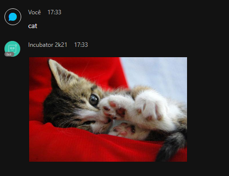
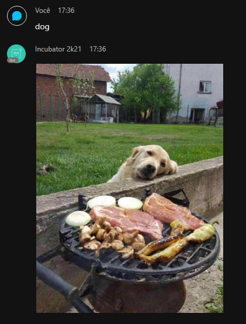
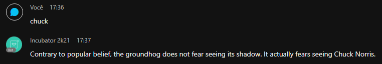
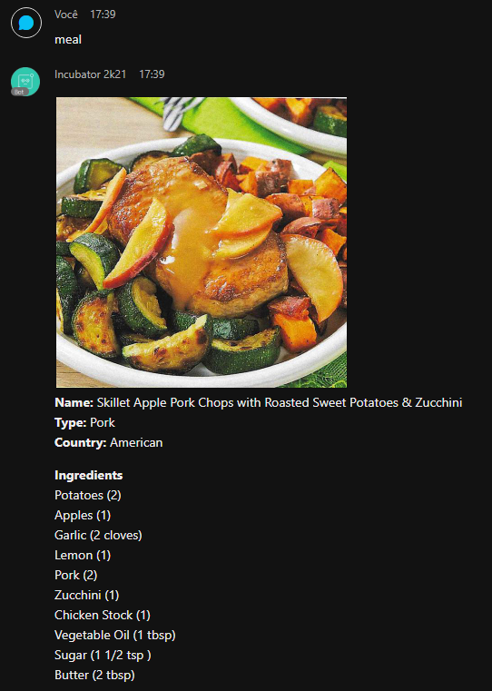
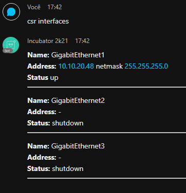

# My PyWebinar4 Webex Bot

## How to use this bot?

Set the follow env variables:
- BOT_NAME (normaly the bot username follow by @webex.com)
- BOT_TOKEN

## What the bot can do?

| **Bot Command**   | **Description**                                                               |
|:-----------------:|-------------------------------------------------------------------------------|
| `cat`             | Displays a random picture of a cat                                            |
| `dog`             | Displays a random picture of a dog                                            |   
| `chuck`           | Texts a random chuck norris joke                                              |
| `meal`            | Display detail information of a meal: country, ingredients, instructions, ... |
| `csr interfaces`  | Display the interfaces of a public CSRv1000 device                            |

### Cat Feature

**API Used:** [thecatapi.com](https://api.thecatapi.com/v1/images/search)

### Dog Feature

**Api Used:** [random.dog](https://random.dog/woof.json)

### Chuck Feature

**Api Used:** [chucknorris.io](https://api.chucknorris.io/jokes/random)

### Meal Feature

**Api Used:** [themealdb.com](https://www.themealdb.com)

### CSRv1000 Interfaces Feature

- Used an always on CSRv1000 instance: sandbox-iosxe-latest-1.cisco.com
- Used RestConf

